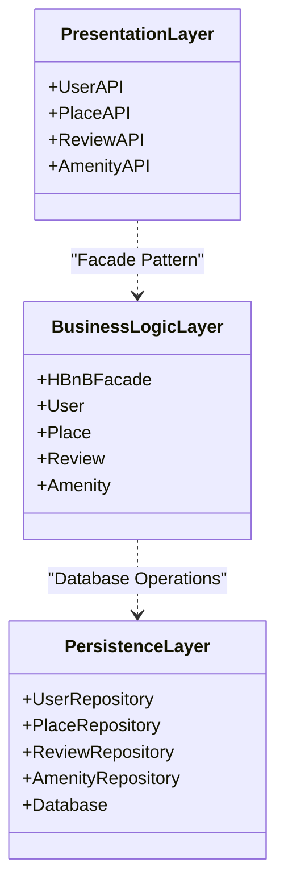
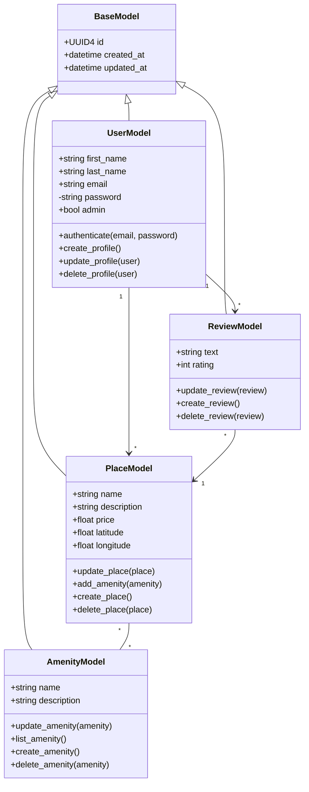
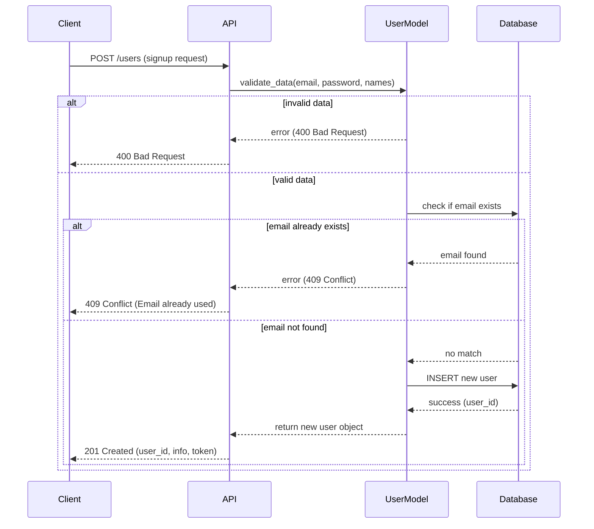
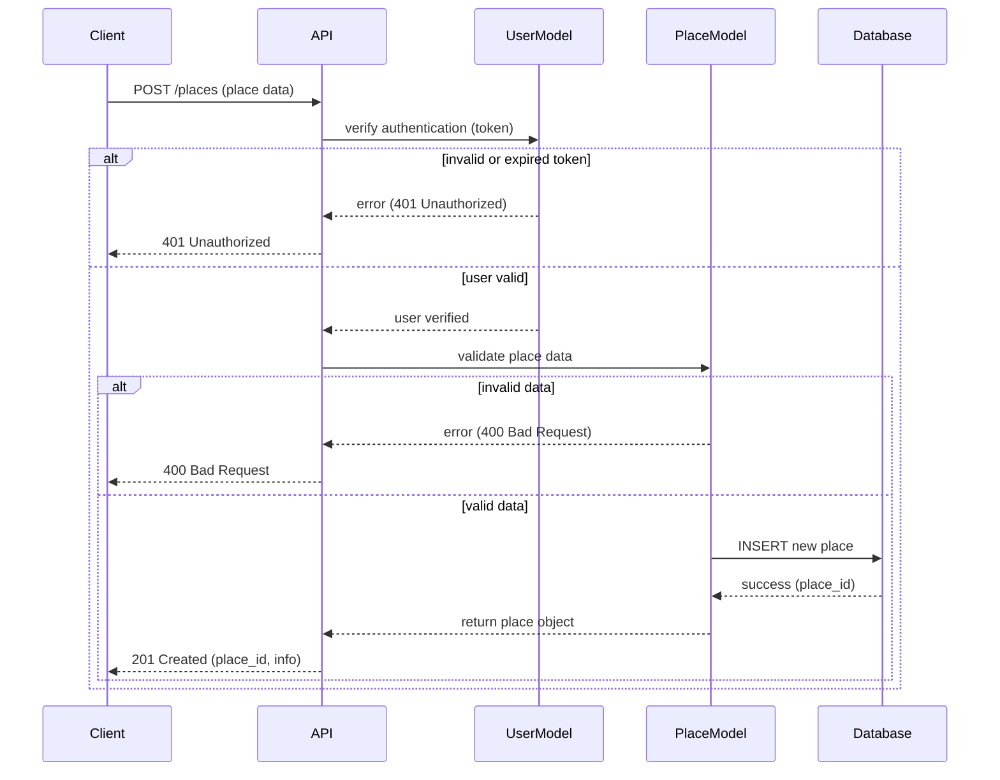
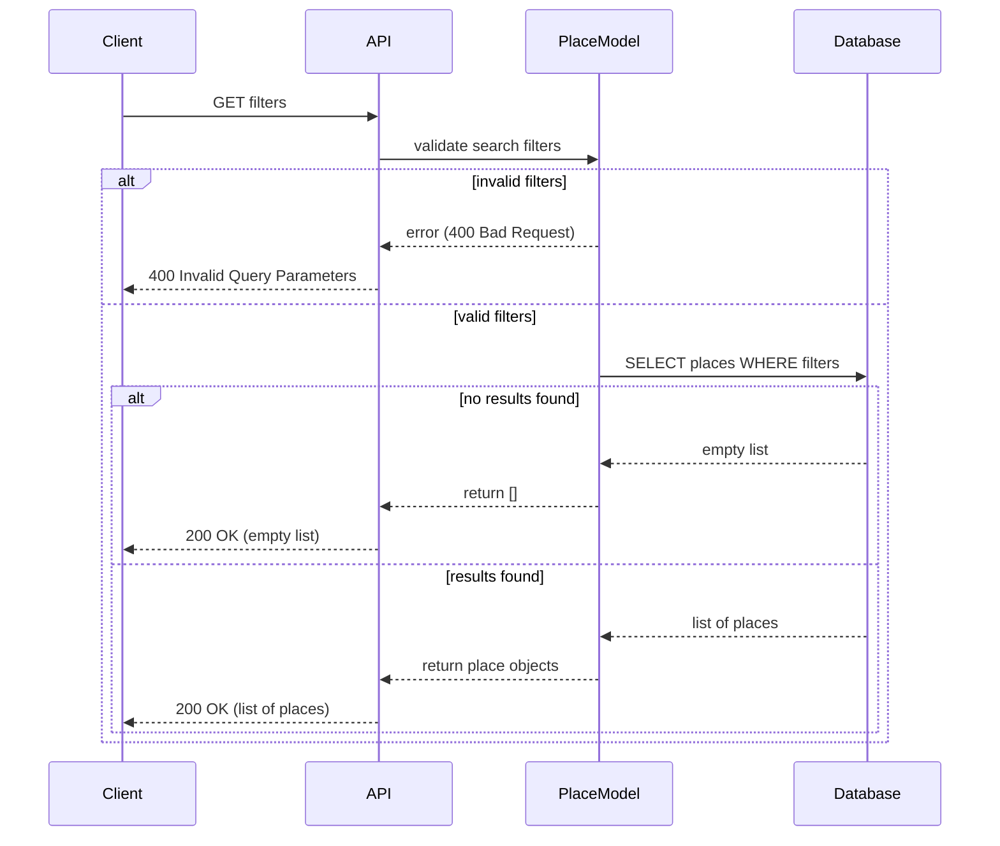
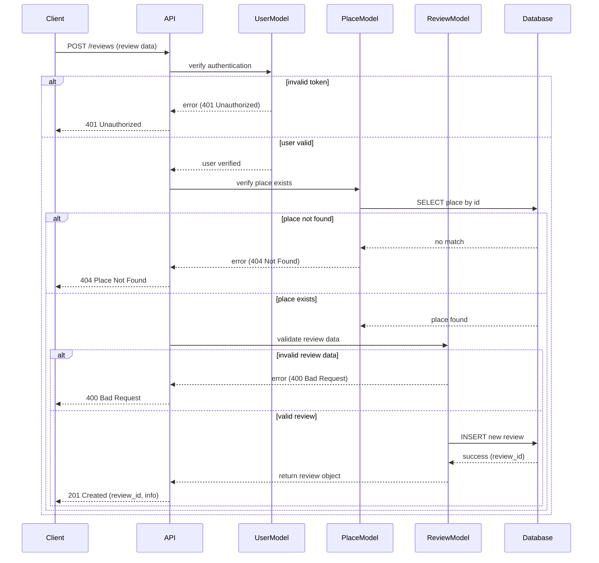

# HBnB — Our Technical Documentation: Architecture Blueprint

---

## 1. What This Document Is About

This document brings together and explains the diagrams and notes we produced during our design phase (high-level package diagram, detailed class diagram for the Business Logic layer, sequence diagrams for API calls). It serves as our technical reference for implementing and maintaining the HBnB project.

**Who might find this useful**: backend developers, architects, project managers, QA teams.

**What we cover**: application architecture, Business Logic design, API interaction flows. We don't dive into detailed infrastructure choices (CI/CD deployment, cloud infra) unless specifically relevant.

---

## 2. Table of Contents

1. [What This Document Is About](#1-what-this-document-is-about)
2. [Table of Contents](#2-table-of-contents)
3. [Our Project Overview](#3-our-project-overview)
4. [The Architecture We Designed](#4-the-architecture-we-designed)
5. [Business Logic Layer (Domain)](#5-business-logic-layer-domain)
6. [API Interaction Flows We Mapped](#6-api-interaction-flows-we-mapped)
7. [Our Design Decisions and Why](#7-our-design-decisions-and-why)
8. [API Contracts (Summary)](#8-api-contracts-summary)
9. [Non-functional Requirements and Constraints](#9-non-functional-requirements-and-constraints)
10. [Our Review/Delivery Checklist](#10-our-reviewdelivery-checklist)
11. [Appendices](#11-appendices)

---

## 3. Our Project Overview

<<<<<<< HEAD
HBnB is the rental application we're building (conceptually similar to "host & bed and breakfast") that will enable:

- **accommodation management** (creation, modification, deletion),
- **search and booking**,
- **availability and calendar management**,
- **billing and payment management**,
- **user management** (hosts, travelers, admins).
=======
HBnB is the rental application we're building (conceptually similar to "Airbed and breakfast") that will enable:
>>>>>>> dev

We designed the system with a layered architecture: presentation (REST API), service/business logic, data access layer (repository/DAL), and persistence (database). We're using a Facade or API service to expose simplified entry points to the upper layer.

---

## 4. The Architecture We Designed

### 4.1 Our High-Level Package Diagram

**What we wanted to show**: the main modules/packages and their dependencies (API, Controllers, Services, Domain, Repositories, Models/DTOs, Infrastructure, Auth).

### 4.2 Key Components We Identified

- **Presentation Layer (API)**: REST controllers, request validation, DTO → Domain mapping
- **Business Logic Layer**: business logic, orchestration, transactions
- **Persistence Layer**: data access abstractions, implementations (SQL/NoSQL)
- **Infrastructure**: external integrations (payments, email, storage)
- **Security**: JWT/OAuth management, access policies

### 4.3 Our Design Decisions

> **Why we chose this**: Clear separation between domain (pure logic) and service (orchestration) to facilitate unit testing and reusability.

> **Our approach**: Dependencies directed inward (outer layers depend on domain abstractions).

> **Pattern we selected**: Facade pattern to provide a stable interface to controllers and mask the complexity of transactional operations.

### 4.4 Why We Chose the Facade Pattern

We implemented the Facade pattern to simplify the interface between the presentation layer and business logic by:
- Centralizing API entry points
- Managing transactions consistently
- Hiding internal complexity of service interactions
- Facilitating testing and maintenance

---

## 5. Business Logic Layer (Domain)

### 5.1 Our Detailed Class Diagram

**What we're representing**: entities, aggregates, repos, domain services and their relationships.

### 5.2 Main Entities We Defined

#### User (host/traveler)
- **attributes**: id, email, hashedPassword, role, profile
- **methods**: authenticate(), canCreateListing(), isHost()

#### Place (accommodation)
- **attributes**: id, ownerId, title, description, location, amenities, basePrice
- **methods**: calculatePrice(dateRange), isAvailable(dateRange)

#### Review (feedback)
- **attributes**: id, placeId, guestId, text, rating, createdAt
- **methods**: validate(), update(), delete()

#### Amenity (equipment)
- **attributes**: id, name, description
- **methods**: create(), update(), delete(), list()

### 5.3 Entity and Relationship Description

- **BaseModel**: abstract class providing common properties (ID, timestamps)
- **UserModel**: represents system users (hosts and travelers)
- **PlaceModel**: represents accommodations available for rental
- **ReviewModel**: represents reviews left by travelers
- **AmenityModel**: represents available equipment and services

### 5.4 Important Business Rules

1. **Authentication**: only authenticated users can create places and reviews
2. **Ownership**: a user can only modify their own places
3. **Reviews**: a user can leave only one review per place
4. **Data Validation**: all mandatory fields must be validated server-side

### 5.5 Services and Domain Objects

- **PlaceService**: place management orchestration
- **UserService**: authentication and profile management
- **ReviewService**: review validation and conflict management
- **AmenityService**: amenity management

### 5.6 Repositories (Interfaces)

- **IUserRepository**, **IPlaceRepository**, **IReviewRepository**, **IAmenityRepository**
- **implementations**: SqlUserRepository, MongoPlaceRepository (examples depending on chosen DB)

> **Reasons**: interfaces allow substitution for testing and variable persistence choices.

---

## 6. API Interaction Flows We Mapped

### 6.1 Sequence Diagrams We Created

We designed the following diagrams to illustrate the main interaction flows:
- User creation
- Place creation
- Place search
- Review creation

### 6.2 Sequence: User Creation

**Actors we identified**: Client (frontend/mobile), API Controller, UserModel, Database

**Key Steps we mapped**:
1. Frontend POST /users with registration data
2. API validates data via UserModel
3. Email uniqueness verification
4. User account creation
5. Authentication token return

### 6.3 Sequence: Place Creation

**What we focused on**: 
- Mandatory authentication verification
- Complete place data validation
- Authorization and validation error handling

### 6.4 Sequence: Place Search

**How we designed it**: frontend → PlaceController.search() → PlaceService applies filters, calls PlaceRepository.search() → map DTOs to frontend. We're planning to add pagination and cache (Redis).

### 6.5 Sequence: Review Creation

**Critical Steps we identified**:
1. User authentication
2. Place existence verification
3. Review data validation
4. Review persistence

---

## 7. Our Design Decisions and Why

### 7.1 Why We Chose Layered Architecture
- **Testing benefits**: each layer can be tested independently
- **Flexibility**: implementations can be changed without impact
- **Clear responsibilities**: each layer has a well-defined role

### 7.2 Our Facade/API Service Approach
- **Controller simplification**: unified interface for complex operations
- **Transaction management**: consistent rollback handling

### 7.3 Our Repository + Interface Strategy
- **Testing advantage**: dependency inversion facilitates unit testing
- **Future flexibility**: simplified database changes

### 7.4 Security Approach We Selected
- **JWT for stateless API**: enables horizontal scalability
- **RBAC for sensitive endpoints**: granular access control
- **Server-side validation**: enhanced security

---

## 8. API Contracts (Summary)

### 8.1 Main Endpoints

#### POST /users (User Creation)
- **Request body**: `{ first_name, last_name, email, password }`
- **Response 201**: `{ user_id, email, token }`
- **Response 409**: Conflict if email already used
- **Response 400**: Invalid data

#### POST /places (Place Creation)
- **Required headers**: `Authorization: Bearer <token>`
- **Request body**: `{ name, description, price, latitude, longitude }`
- **Response 201**: `{ place_id, name, price }`
- **Response 401**: Invalid or expired token
- **Response 400**: Invalid data

#### GET /places (Place Search)
- **Query params**: `city, price_min, price_max`
- **Response 200**: `[{ place_id, name, price, location }]`
- **Response 400**: Invalid search parameters

#### POST /reviews (Review Creation)
- **Required headers**: `Authorization: Bearer <token>`
- **Request body**: `{ place_id, text, rating }`
- **Response 201**: `{ review_id, text, rating }`
- **Response 404**: Place not found
- **Response 401**: Not authenticated

---

## 9. Non-functional Requirements and Constraints

### 9.1 Performance
- **Response time**: search and list pages < 300ms under normal load
- **Optimizations**: DB indexes and Redis cache recommended

### 9.2 Scalability
- **Stateless architecture**: JWT to facilitate scaling
- **Distributed cache**: Redis for frequent queries

### 9.3 Resilience
- **Error handling**: retry/backoff on external integrations
- **Circuit-breaker**: protection against failure cascades

### 9.4 Observability
- **Structured logs**: JSON format to facilitate analysis
- **Distributed tracing**: OpenTelemetry recommended
- **Metrics**: Prometheus for monitoring

### 9.5 Security
- **Encryption**: sensitive data encrypted in database
- **Validation**: sanitization of all user inputs
- **Rate limiting**: protection against abuse

---

## About This Work

**Created by Jordann Miso** & **Mickael Mur**

*My Holberton School Project - Part 1*

---
