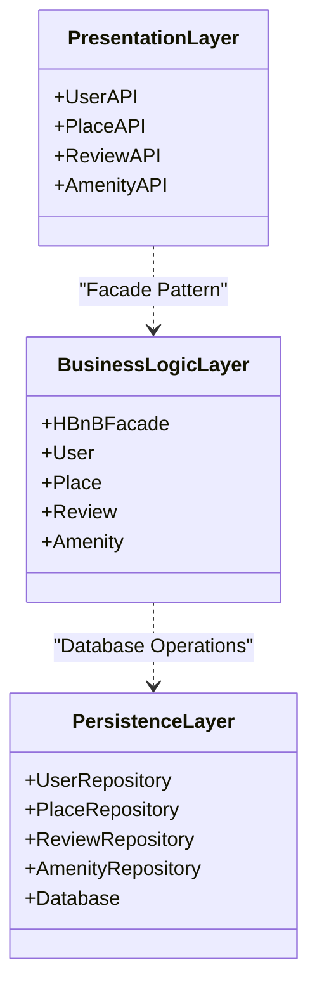
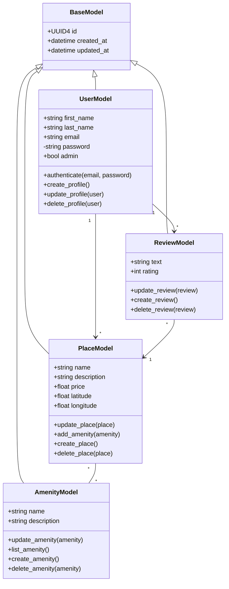
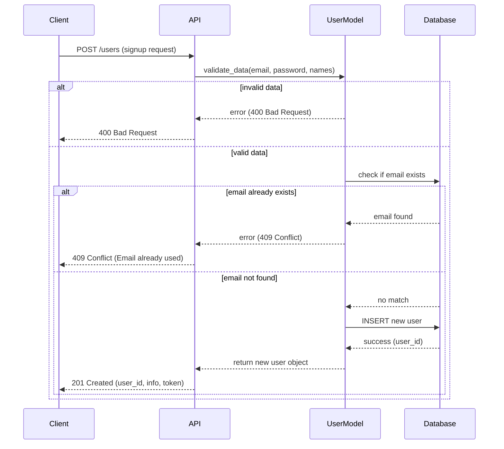
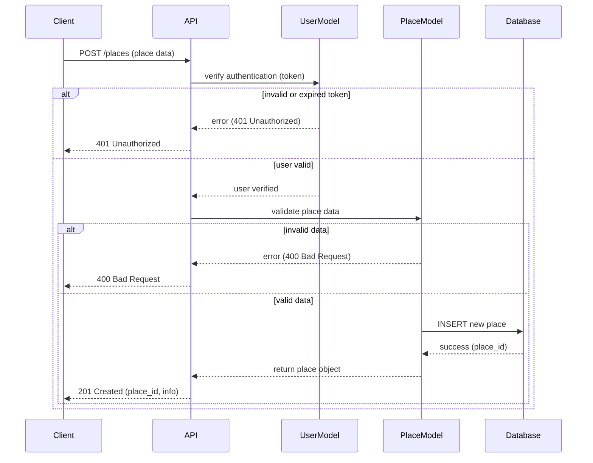
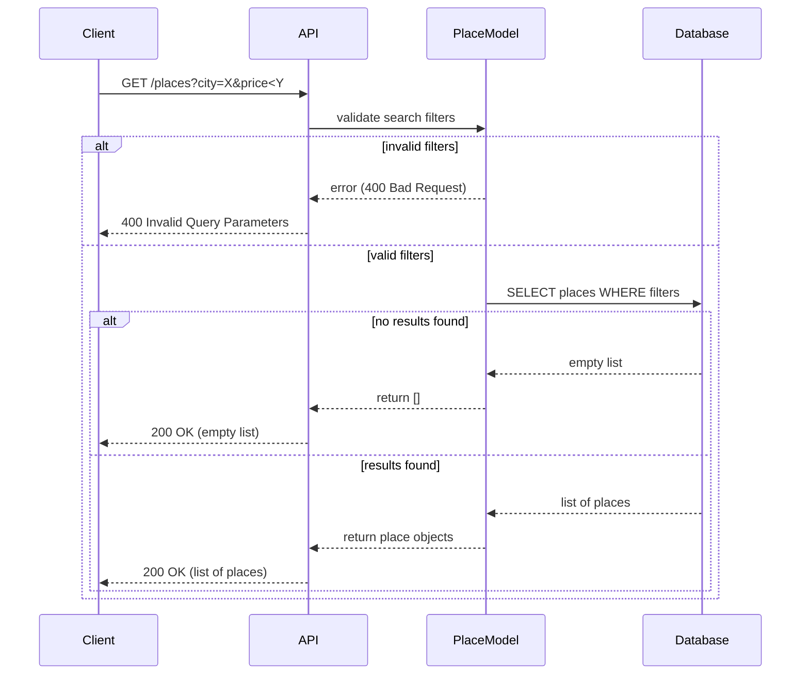
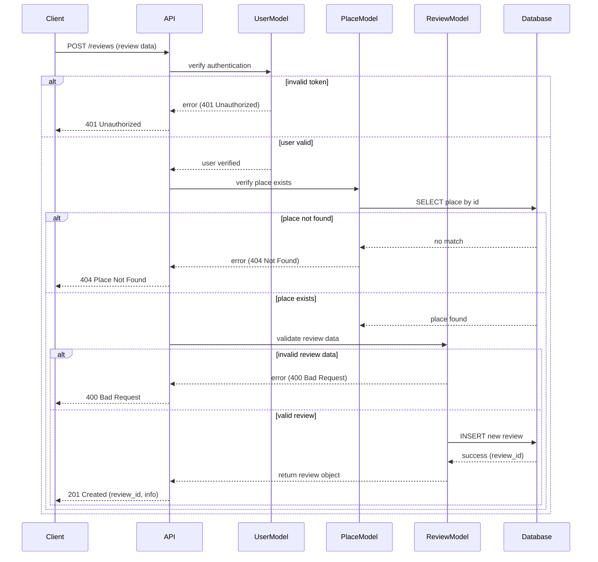

# HBnB — Document technique : Blueprint d'architecture

---

## 1. Objet du document

Ce document regroupe et explique les diagrammes et notes produits lors des tâches précédentes (diagramme de packages haut niveau, diagramme de classes détaillé pour la couche Business Logic, diagrammes de séquence pour les appels API). Il sert de référence technique pour l'implémentation et la maintenance du projet HBnB.

**Public visé** : développeurs backend, architectes, chefs de projet, QA.

**Périmètre** : architecture applicative, conception de la Business Logic, flux d'interaction API. Ne couvre pas les choix d'infrastructure détaillés (déploiement CI/CD, infra cloud) sauf mention explicite.

---

## 2. Table des matières

1. [Objet du document](#1-objet-du-document)
2. [Table des matières](#2-table-des-matières)
3. [Vue d'ensemble du projet](#3-vue-densemble-du-projet)
4. [Architecture globale](#4-architecture-globale)
5. [Couche Business Logic (Domain)](#5-couche-business-logic-domain)
6. [Flux d'interaction API](#6-flux-dinteraction-api)
7. [Décisions de conception et justifications](#7-décisions-de-conception-et-justifications)
8. [Contrats API (résumé)](#8-contrats-api-résumé)
9. [Non-fonctionnel et contraintes](#9-non-fonctionnel-et-contraintes)
10. [Checklist de relecture / livraison](#10-checklist-de-relecture--livraison)
11. [Annexes](#11-annexes)

---

## 3. Vue d'ensemble du projet

HBnB est une application de location (similaire conceptuellement à « hôte & bed and breakfast ») qui permet :

- **gestion des hébergements** (création, modification, suppression),
- **recherche et réservation**,
- **gestion des disponibilités et calendriers**,
- **facturation et gestion des paiements**,
- **gestion des utilisateurs** (hôtes, voyageurs, admins).

Le système adopte une architecture en couches : présentation (API REST), service / business logic, couche d'accès aux données (repository / DAL), et persistance (base de données). Une façade (Facade) ou API service expose des points d'entrée simplifiés à la couche supérieure.

---

## 4. Architecture globale

### 4.1 Diagramme de packages (HAUT NIVEAU)

**Objectif du diagramme** : montrer les principaux modules/packages et leurs dépendances (API, Controllers, Services, Domain, Repositories, Models/DTOs, Infrastructure, Auth).

### 4.2 Composants clés

- **Presentation Layer (API)** : contrôleurs REST, validation des requêtes, mapping DTO → Domain
- **Business Logic Layer** : logique métier, orchestration, transactions
- **Persistence Layer** : abstractions d'accès aux données, implémentations (SQL/NoSQL)
- **Infrastructure** : intégrations externes (paiements, email, storage)
- **Security** : gestion JWT / OAuth, politiques d'accès

### 4.3 Décisions de conception

> **Decision** : Séparation claire entre domain (logique pure) et service (orchestration) pour faciliter tests unitaires et réutilisabilité.

> **Decision** : Dépendances dirigées vers l'intérieur (outer layers dépendent des abstractions du domain).

> **Decision** : Pattern façade pour fournir une interface stable aux contrôleurs et masquer la complexité des opérations transactionnelles.

### 4.4 Pattern façade et raisons

Le pattern Façade simplifie l'interface entre la couche de présentation et la logique métier en :
- Centralisant les points d'entrée de l'API
- Gérant les transactions de manière cohérente
- Masquant la complexité interne des interactions entre services
- Facilitant les tests et la maintenance

---

## 5. Couche Business Logic (Domain)

### 5.1 Diagramme de classes détaillé

**But** : représenter les entités, agrégats, repos, services de domaine et leurs relations.

### 5.2 Principales entités (extrait)

#### User (hôte / voyageur)
- **attributs** : id, email, hashedPassword, role, profile
- **méthodes** : authenticate(), canCreateListing(), isHost()

#### Place (hébergement)
- **attributs** : id, ownerId, title, description, location, amenities, basePrice
- **méthodes** : calculatePrice(dateRange), isAvailable(dateRange)

#### Review (avis)
- **attributs** : id, placeId, guestId, text, rating, createdAt
- **méthodes** : validate(), update(), delete()

#### Amenity (équipement)
- **attributs** : id, name, description
- **méthodes** : create(), update(), delete(), list()

### 5.3 Description des entités et relations

- **BaseModel** : classe abstraite fournissant les propriétés communes (ID, timestamps)
- **UserModel** : représente les utilisateurs du système (hôtes et voyageurs)
- **PlaceModel** : représente les logements disponibles à la location
- **ReviewModel** : représente les avis laissés par les voyageurs
- **AmenityModel** : représente les équipements et services disponibles

### 5.4 Règles métier importantes

1. **Authentification** : seuls les utilisateurs authentifiés peuvent créer des places et des reviews
2. **Propriété** : un utilisateur ne peut modifier que ses propres places
3. **Reviews** : un utilisateur ne peut laisser qu'un seul avis par place
4. **Validation des données** : tous les champs obligatoires doivent être validés côté serveur

### 5.5 Services et objets de domaine

- **PlaceService** : orchestration de la gestion des places
- **UserService** : gestion de l'authentification et des profils
- **ReviewService** : validation des avis et gestion des conflits
- **AmenityService** : gestion des équipements

### 5.6 Repositories (interfaces)

- **IUserRepository**, **IPlaceRepository**, **IReviewRepository**, **IAmenityRepository**
- **implémentations** : SqlUserRepository, MongoPlaceRepository (exemples selon DB choisie)

> **Raisons** : interfaces permettent substitution pour tests et choix de persistance variable.

---

## 6. Flux d'interaction API

### 6.1 Diagrammes de séquence inclus

Les diagrammes suivants illustrent les principaux flux d'interaction :
- Création d'un utilisateur
- Création d'une place
- Recherche de places
- Création d'un avis

### 6.2 Séquence : Création d'un utilisateur

**Acteurs** : Client (frontend/mobile), API Controller, UserModel, Database

**Étapes clefs** :
1. Frontend POST /users avec données d'inscription
2. API valide les données via UserModel
3. Vérification de l'unicité de l'email
4. Création du compte utilisateur
5. Retour du token d'authentification

### 6.3 Séquence : Création d'une place

**Points d'attention** : 
- Vérification de l'authentification obligatoire
- Validation complète des données de la place
- Gestion des erreurs d'autorisation et de validation

### 6.4 Séquence : Recherche de places

**Résumé** : frontend → PlaceController.search() → PlaceService applique filtres, appelle PlaceRepository.search() → mapper DTOs vers frontend. Pagination, cache (Redis) recommandé.

### 6.5 Séquence : Création d'un avis

**Étapes critiques** :
1. Authentification de l'utilisateur
2. Vérification de l'existence de la place
3. Validation des données de l'avis
4. Persistance de l'avis

---

## 7. Décisions de conception et justifications

### 7.1 Architecture en couches
- **Facilite tests** : chaque couche peut être testée indépendamment
- **Remplaçabilité** : les implémentations peuvent être changées sans impact
- **Séparation de responsabilités** : chaque couche a un rôle bien défini

### 7.2 Façade/API Service
- **Simplifie controllers** : interface unifiée pour les opérations complexes
- **Centralise transactions** : gestion cohérente des rollbacks

### 7.3 Repositories + Interfaces
- **Inversion de dépendance** : facilite les tests unitaires
- **Migrations DB futures** : changement de base de données simplifié

### 7.4 Sécurité
- **JWT pour API stateless** : scalabilité horizontale
- **RBAC pour endpoints sensibles** : contrôle d'accès granulaire
- **Validation côté serveur** : sécurité renforcée

---

## 8. Contrats API (résumé)

### 8.1 Endpoints principaux

#### POST /users (Création d'utilisateur)
- **Request body** : `{ first_name, last_name, email, password }`
- **Response 201** : `{ user_id, email, token }`
- **Response 409** : Conflit si email déjà utilisé
- **Response 400** : Données invalides

#### POST /places (Création de place)
- **Headers requis** : `Authorization: Bearer <token>`
- **Request body** : `{ name, description, price, latitude, longitude }`
- **Response 201** : `{ place_id, name, price }`
- **Response 401** : Token invalide ou expiré
- **Response 400** : Données invalides

#### GET /places (Recherche de places)
- **Query params** : `city, price_min, price_max`
- **Response 200** : `[{ place_id, name, price, location }]`
- **Response 400** : Paramètres de recherche invalides

#### POST /reviews (Création d'avis)
- **Headers requis** : `Authorization: Bearer <token>`
- **Request body** : `{ place_id, text, rating }`
- **Response 201** : `{ review_id, text, rating }`
- **Response 404** : Place non trouvée
- **Response 401** : Non authentifié

---

## 9. Non-fonctionnel et contraintes

### 9.1 Performance
- **Temps de réponse** : recherche et pages listes < 300ms sous charge normale
- **Optimisations** : index DB et cache Redis recommandés

### 9.2 Scalabilité
- **Architecture stateless** : JWT pour faciliter la montée en charge
- **Cache distribué** : Redis pour les requêtes fréquentes

### 9.3 Résilience
- **Gestion d'erreur** : retry/backoff sur intégrations externes
- **Circuit-breaker** : protection contre les cascades de pannes

### 9.4 Observabilité
- **Logs structurés** : format JSON pour faciliter l'analyse
- **Traces distribuées** : OpenTelemetry recommandé
- **Métriques** : Prometheus pour le monitoring

### 9.5 Sécurité
- **Chiffrement** : données sensibles chiffrées en base
- **Validation** : sanitisation de toutes les entrées utilisateur
- **Rate limiting** : protection contre les abus

---

## 10. Checklist de relecture / livraison

- [ ] Diagrammes intégrés et à jour
- [ ] Contrats API documentés
- [ ] Tests unitaires couvrant les règles métier
- [ ] Documentation de déploiement
- [ ] Configuration de sécurité validée
- [ ] Monitoring et alertes configurés
- [ ] Performance testée sous charge
- [ ] Relecture par un pair architecture
- [ ] Relecture orthographe et style

---
