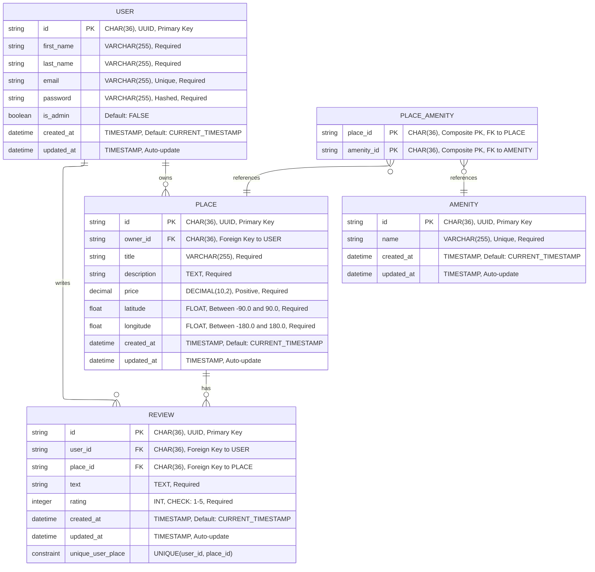

# HBnB Application - Part 3

## Project Overview

This is the third part of the HBnB (Holberton Airbnb clone) project, focusing on database persistence with SQLAlchemy, authentication with JWT, and password hashing.

## Project Structure

```
hbnb/
├── app/
│   ├── __init__.py              # Flask application factory with SQLAlchemy, Bcrypt and JWT
│   ├── api/
│   │   ├── __init__.py
│   │   └── v1/
│   │       ├── __init__.py
│   │       ├── users.py         # User API endpoints
│   │       ├── places.py        # Place API endpoints
│   │       ├── reviews.py       # Review API endpoints
│   │       ├── amenities.py     # Amenity API endpoints
│   │       └── auth.py          # Authentication endpoints (login, protected)
│   ├── models/
│   │   ├── __init__.py
│   │   ├── base.py              # Base model with SQLAlchemy
│   │   ├── user.py              # User model with password hashing
│   │   ├── place.py             # Place model with relationships
│   │   ├── review.py            # Review model
│   │   └── amenity.py           # Amenity model
│   ├── services/
│   │   ├── __init__.py          # Facade singleton instance
│   │   └── facade.py            # Facade pattern implementation
│   └── persistence/
│       ├── __init__.py
│       ├── repository.py        # SQLAlchemy and In-memory repository implementations
│       └── user_repository.py   # Specialized user repository with email lookup
├── sql/
│   ├── users.sql                # Users table schema
│   ├── places.sql               # Places table schema
│   ├── reviews.sql              # Reviews table schema
│   ├── amenities.sql            # Amenities table schema
│   ├── place_amenity.sql        # Many-to-many relationship table
│   └── insert_data.sql          # Sample data
├── tests/
│   ├── __init__.py
│   ├── test_endpoint.py         # Automated API endpoint tests with JWT
│   ├── test_core_classes.py     # Core model validation tests
│   └── test_endpoint_report.md  # Test results report
├── init_db.py                   # Database initialization script
├── run.py                       # Application entry point
├── config.py                    # Environment configuration with SQLAlchemy settings
├── requirements.txt             # Python dependencies
├── hbnb_database_er_diagram.mmd # Database Entity-Relationship diagram
└── README.md                    # This file
```

## Architecture

This project follows a three-layer architecture:

1. **Presentation Layer** (`app/api/`): REST API endpoints using Flask-RESTX with JWT authentication
2. **Business Logic Layer** (`app/models/` and `app/services/`): Domain models with SQLAlchemy and business rules
3. **Persistence Layer** (`app/persistence/`): Data storage with SQLAlchemy repository pattern

### Key Components

- **Facade Pattern** (`app/services/facade.py`): Centralized interface for communication between layers
- **Repository Pattern** (`app/persistence/repository.py`): Abstract interface with SQLAlchemy and in-memory implementations
- **API Versioning** (`app/api/v1/`): RESTful endpoints organized by version
- **Authentication** (`app/api/v1/auth.py`): JWT-based authentication with login and protected endpoints
- **Password Security** (`app/models/user.py`): Bcrypt password hashing

### Key Features

- **SQLAlchemy ORM**: Database models with relationships (User, Place, Review, Amenity)
- **JWT Authentication**: Secure token-based authentication with role-based access (is_admin)
- **Password Hashing**: Bcrypt for secure password storage
- **Database Relationships**: One-to-many and many-to-many relationships between models
- **SQL Schema**: Pre-defined SQL scripts for table creation and sample data

## Installation and Setup

### Prerequisites
- Python 3.12 or higher
- pip (Python package manager)
- Virtual environment (recommended)

### Setup Instructions

1. **Clone the repository** (if not already done):
   ```bash
   git clone <repository-url>
   cd holbertonschool-hbnb/part3/hbnb
   ```

2. **Create a virtual environment** (recommended):
   ```bash
   python3 -m venv venv
   source venv/bin/activate  # On Windows: venv\Scripts\activate
   ```

3. **Install dependencies**:
   ```bash
   pip install -r requirements.txt
   ```

4. **Initialize the database**:
   ```bash
   python init_db.py
   ```
   This will create the SQLite database (`development.db`) with all required tables.

5. **Run the application**:
   ```bash
   python run.py
   ```
   The application will start on `http://localhost:5000`

6. **Access the API documentation**:
   Open your browser and navigate to `http://localhost:5000/api/v1/`
   The interactive Swagger UI documentation will be available.

## Development

### Environment Configuration

The application uses environment-based configuration defined in `config.py`:
- `development`: Debug mode enabled with SQLite database (`development.db`)
- SQLAlchemy configuration with automatic database URI setup
- Secret key for JWT token generation

### Database Models

All models inherit from `BaseModel` which provides:
- UUID primary key
- created_at and updated_at timestamps
- SQLAlchemy declarative base

**Relationships:**
- User has many Places (one-to-many)
- User has many Reviews (one-to-many)
- Place has many Reviews (one-to-many)
- Place has many Amenities (many-to-many via place_amenity table)

### API Documentation

The API is documented using Flask-RESTX and is available at `/api/v1/` when the application is running.

## Dependencies

- **Flask**: Web framework
- **Flask-RESTX**: REST API framework with automatic documentation
- **Flask-JWT-Extended**: JWT token authentication
- **Flask-Bcrypt**: Password hashing
- **SQLAlchemy**: ORM for database interactions
- **Flask-SQLAlchemy**: Flask integration for SQLAlchemy

## Testing

The project includes comprehensive automated tests for all API endpoints and core model classes.

### Test Results Summary

**API Testing Report - November 6, 2025**

- **Total tests:** 79 (52 API endpoint tests + 27 core model tests)
- **Successful tests:** 79
- **Failed tests:** 0
- **Success rate:** 100%
- **Test execution time:** ~3 seconds (core classes)

### Test Suites

#### test_endpoint.py (52 tests)
**Purpose:** Validates API endpoint functionality with JWT authentication and authorization

**Test Categories:**
- **Authentication Tests (6 tests):** Login with valid/invalid credentials, protected endpoints, JWT token validation
- **User Endpoints (12 tests):** User creation with password, validation for empty/whitespace fields, email format validation, missing required fields, duplicate email handling, JWT authentication for profile updates, ownership verification, admin privileges
- **Place Endpoints (13 tests):** Place creation with JWT, title validation, price validation (negative/zero values), geographic coordinates validation (latitude: -90 to 90, longitude: -180 to 180), JWT authentication, ownership verification for updates/deletes
- **Review Endpoints (15 tests):** Review creation with JWT, text validation, user/place ID validation, rating validation (1-5), ownership verification, unique user-place constraint
- **Amenity Endpoints (6 tests):** Amenity creation (admin only), name validation, duplicate detection, missing fields, name length validation (max 50 characters)

#### test_core_classes.py (27 tests)
**Purpose:** Validates core model classes and business logic

**Test Categories:**
- **BaseModel Tests (3 tests):** ID generation, timestamps, save/update functionality
- **User Model Tests (9 tests):** User creation, field validation (first_name, last_name, email), password hashing, is_admin default value
- **Amenity Model Tests (5 tests):** Amenity creation, name validation (empty, whitespace, length, type), update functionality
- **Place Model Tests (5 tests):** Place creation with relationships, title validation, price validation (negative), coordinate validation (latitude/longitude ranges)
- **Review Model Tests (5 tests):** Review creation with user and place relationships, text validation, rating validation (range 1-5)

### Key Validations Implemented
- **Email Format:** Comprehensive regex validation
- **Geographic Coordinates:** Proper latitude/longitude bounds
- **Data Integrity:** Required field validation and type checking
- **Error Handling:** Appropriate HTTP status codes (400 for validation errors, 404 for not found, 409 for conflicts)
- **Type Safety:** Strict type validation for all inputs
- **Boundary Testing:** Extreme values and edge cases handled correctly
- **Password Security:** Bcrypt hashing for all user passwords
- **JWT Authentication:** Token-based authentication with role-based access control
- **Ownership Verification:** Users can only modify their own resources (unless admin)
- **Unique Constraints:** One review per user per place, unique email addresses

### Running Tests

To run all the automated tests:
```bash
# Activate virtual environment first
source venv/bin/activate  # On Windows: venv\Scripts\activate

# Run all tests
python -m pytest tests/ -v

# Run specific test file for API endpoints
python -m pytest tests/test_endpoint.py -v

# Run specific test file for core model classes
python -m pytest tests/test_core_classes.py -v

# Run with coverage report
python -m pytest tests/ --cov=app --cov-report=html
```

For detailed test results, see `tests/test_endpoint_report.md` and `test_core_classes_report.txt`.

## API Endpoints

### Authentication
- `POST /api/v1/auth/login` - Login with email and password, returns JWT token
- `GET /api/v1/auth/protected` - Protected endpoint requiring valid JWT token

### Users
- `POST /api/v1/users` - Create a new user
- `GET /api/v1/users` - Get all users
- `GET /api/v1/users/<user_id>` - Get a specific user
- `PUT /api/v1/users/<user_id>` - Update a user

### Places
- `POST /api/v1/places` - Create a new place
- `GET /api/v1/places` - Get all places
- `GET /api/v1/places/<place_id>` - Get a specific place
- `PUT /api/v1/places/<place_id>` - Update a place
- `GET /api/v1/places/<place_id>/reviews` - Get all reviews for a place

### Reviews
- `POST /api/v1/reviews` - Create a new review
- `GET /api/v1/reviews` - Get all reviews
- `GET /api/v1/reviews/<review_id>` - Get a specific review
- `PUT /api/v1/reviews/<review_id>` - Update a review
- `DELETE /api/v1/reviews/<review_id>` - Delete a review

### Amenities
- `POST /api/v1/amenities` - Create a new amenity
- `GET /api/v1/amenities` - Get all amenities
- `GET /api/v1/amenities/<amenity_id>` - Get a specific amenity
- `PUT /api/v1/amenities/<amenity_id>` - Update an amenity

## API Documentation

The API is fully documented using Flask-RESTX and Swagger UI:
- Access the interactive documentation at `http://localhost:5000/api/v1/`
- All endpoints include proper schemas and response codes
- Complete data model definitions
- JWT authentication endpoints for secure access

## Security Features

- **Password Hashing**: User passwords are hashed using Bcrypt before storage
- **JWT Authentication**: Token-based authentication for protected endpoints
- **Role-Based Access**: Admin flag in JWT claims for role-based authorization
- **Secure Token Generation**: Secret key configuration for JWT token signing

### RBAC (Role-Based Access Control)

This application implements a role-based access control system with three roles:

| Endpoint | Method | Unauthenticated | Authenticated User | Admin |
|----------|--------|-----------------|-------------------|-------|
| **Authentication** |
| `/api/v1/auth/login` | POST | ✅ | ✅ | ✅ |
| `/api/v1/auth/protected` | GET | ❌ | ✅ | ✅ |
| **Users** |
| `/api/v1/users` | POST | ✅ (registration) | ❌ (403 Forbidden) | ✅ (create user) |
| `/api/v1/users` | GET | ✅ (public fields only) | ✅ (public fields only) | ✅ (all fields) |
| `/api/v1/users/<id>` | GET | ✅ (public fields only) | ✅ (public fields only) | ✅ (all fields) |
| `/api/v1/users/<id>` | PUT | ❌ | ✅ (own profile only, limited fields) | ✅ (any user, all fields) |
| **Places** |
| `/api/v1/places` | POST | ❌ | ✅ (as owner) | ✅ |
| `/api/v1/places` | GET | ✅ | ✅ | ✅ |
| `/api/v1/places/<id>` | GET | ✅ | ✅ | ✅ |
| `/api/v1/places/<id>` | PUT | ❌ | ✅ (own places only) | ✅ (any place) |
| `/api/v1/places/<id>` | DELETE | ❌ | ✅ (own places only) | ✅ (any place) |
| `/api/v1/places/<id>/reviews` | GET | ✅ | ✅ | ✅ |
| **Reviews** |
| `/api/v1/reviews` | POST | ❌ | ✅ (as author) | ✅ |
| `/api/v1/reviews` | GET | ✅ | ✅ | ✅ |
| `/api/v1/reviews/<id>` | GET | ✅ | ✅ | ✅ |
| `/api/v1/reviews/<id>` | PUT | ❌ | ✅ (own reviews only) | ✅ (any review) |
| `/api/v1/reviews/<id>` | DELETE | ❌ | ✅ (own reviews only) | ✅ (any review) |
| **Amenities** |
| `/api/v1/amenities` | POST | ❌ | ❌ | ✅ (admin only) |
| `/api/v1/amenities` | GET | ✅ | ✅ | ✅ |
| `/api/v1/amenities/<id>` | GET | ✅ | ✅ | ✅ |
| `/api/v1/amenities/<id>` | PUT | ❌ | ❌ | ✅ (admin only) |

**Legend:**
- ✅ = Access granted
- ❌ = Access denied (401 Unauthorized or 403 Forbidden)

**Key Access Control Rules:**

1. **Unauthenticated Users:**
   - Can register (create their own user account via public registration)
   - Can view public data (users, places, reviews, amenities) with limited fields
   - Cannot create, update, or delete any resources except their own registration

2. **Authenticated Users (Regular Users):**
   - **Cannot create other user accounts** (403 Forbidden) - only admins can create users when authenticated
   - Can create places (as owner) and reviews (as author)
   - Can update/delete their own places and reviews only
   - Can update their own profile with limited fields (cannot change email or password)
   - Cannot manage amenities

3. **Administrators:**
   - **Can create user accounts** with all fields including password and is_admin flag
   - Full access to all resources
   - Can create, update, and delete any place or review
   - Can manage amenities (create, update)
   - Can modify any user profile including email, password, and is_admin flag
   - Can view all user fields including sensitive information

**Implementation Details:**
- Authentication is handled via JWT tokens with `is_admin` claim
- Ownership verification ensures users can only modify their own resources
- Admin bypass allows administrators to manage any resource
- Protected endpoints use `@jwt_required()` decorator
- Admin-only endpoints check `is_admin` flag in JWT claims

## Database

- **Database Engine**: SQLite (development.db)
- **ORM**: SQLAlchemy with declarative models
- **Initialization**: `init_db.py` script creates all tables
- **SQL Scripts**: Pre-defined schemas in `sql/` directory for reference

### Database Entity-Relationship Diagram

The following diagram illustrates the database schema and relationships between entities:



**Key Relationships:**
- A **USER** can own multiple **PLACES** (one-to-many)
- A **USER** can write multiple **REVIEWS** (one-to-many)
- A **PLACE** can have multiple **REVIEWS** (one-to-many)
- A **PLACE** can have multiple **AMENITIES** through the **PLACE_AMENITY** junction table (many-to-many)
- Each **REVIEW** is unique per user and place combination (enforced by unique constraint)

## Contributing

This project is part of the Holberton School curriculum. Follow the project guidelines and coding standards as specified in the course materials.
